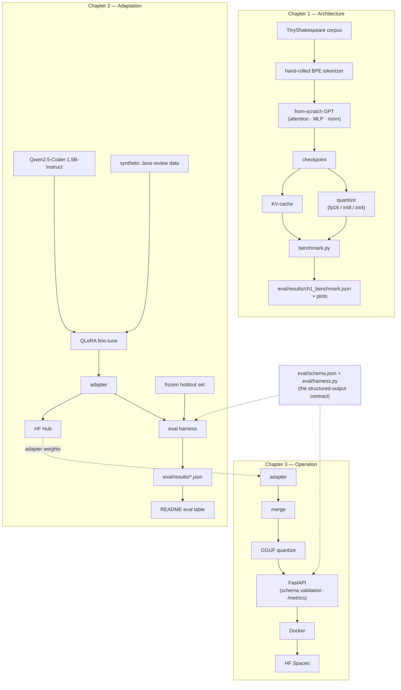

# LLM Engineering: From Architecture to Edge

Three connected chapters on one theme: *understanding a model from its internals all the way to a deployed edge service.*

The chapters share a narrative, not a model. Chapter 1 proves understanding on a toy transformer built by hand. Chapters 2 and 3 take a real small open model and carry it to the edge.

| Chapter | What it does | Headline artifact |
|---|---|---|
| **1 — Architecture** (`ch1_architecture/`) | A GPT-style LM written from scratch in pure PyTorch — embeddings, multi-head attention, MLP, norm, training loop — then a KV-cache and quantization added on top. | tokens/sec speedup curve · perplexity-vs-quantization tradeoff |
| **2 — Adaptation** (`ch2_adaptation/`) | QLoRA fine-tune of `Qwen/Qwen2.5-Coder-1.5B-Instruct` into a Java/Spring code reviewer that emits structured JSON. | head-to-head eval table: fine-tuned vs base vs frontier-API few-shot |
| **3 — Operation** (`ch3_operation/`) | The fine-tuned model quantized to GGUF, served behind FastAPI with schema validation and latency/drift monitoring, containerized and deployed. | live CPU demo on HF Spaces |

## Live demo

*(pending — O5 deploy)* The HF Spaces link and a worked example go here once the Space is
live — see `docs/DEPLOY.md` and `specs/STATUS.md` for exactly what's blocking it (a real
GGUF from the O1 export and a human decision to publish a public URL). Until then, the
same request the live demo will accept is runnable locally — see [API](#api) below for
the full Java-in/JSON-out example against `uv run python -m ch3_operation.serve`.

## Architecture

How the three chapters connect — file-shaped, not import-shaped. Chapter 1 is a
self-contained parallel track with no edge into Chapters 2/3: that separation is a design
decision, not an oversight (`CLAUDE.md`'s "the chapters have no runtime dependency on
each other"). Chapters 2 and 3 share one spine: `eval/schema.json` and `eval/harness.py`
are the structured-output contract the whole project hangs on.



## Results

**Chapter 2 — head-to-head on the frozen holdout set** *(spec C5)*

<!-- EVAL_TABLE_START -->
| System | Schema-validity | Bug-catch | n |
|---|---|---|---|
| Fine-tuned (QLoRA, Qwen2.5-Coder-1.5B) | — | — | — |
| Base model (zero-shot) | — | — | — |
| Frontier API (3-shot) | — | — | — |
<!-- EVAL_TABLE_END -->

The holdout is **specified** at 40 records (30 hand-written synthetic-clean, 10 mined from
real Java/Spring code), to be built and frozen before any fine-tuning token is spent, and
deduplicated against both the training set and the earlier C1 stub set by content hash
(`ch2_adaptation/holdout_curator.py`). Once frozen, no training, data-generation, or
prompt-tuning code may read it — a repo hook enforces that unconditionally. **Current
state:** 30 synthetic records are staged in `eval/staging/`; the 10 mined records and the
freeze step are pending — see `specs/STATUS.md` (spec C2) for status. See
[`docs/finetune-vs-prompting.md`](docs/finetune-vs-prompting.md) for what this table will
mean once it is filled.

**Chapter 1 — speedup and quantization cost** *(spec A5)*

<!-- CH1_BENCHMARK_START -->
*(filled by `ch1_architecture.benchmark` against the full-config checkpoint — tokens/sec and perplexity per quantization mode, plus the KV-cache speedup. The smoke config exercises this same code path end to end but its numbers are not meaningful: an undertrained toy model on a 5 KB corpus.)*
<!-- CH1_BENCHMARK_END -->

Once filled, the two plots show two independent tradeoffs, not one curve: the bar chart is
inference speed by quantization mode (memory-bandwidth bound, not compute bound — see
[`docs/quantization.md`](docs/quantization.md) for why fp16-on-CPU being *slower* than
fp32 is an expected, reported result here, not a bug), and the second is the perplexity
cost that speed buys. The KV-cache line is a separate comparison again — see
[`docs/kv-cache.md`](docs/kv-cache.md) for why it speeds up decoding but not prefill.

**Chapter 3 — serving** *(spec O3, numbers filled in by O5 against the live deployment)*

<!-- SERVING_METRICS_START -->
*(p50/p99 latency, throughput, live link — filled by `scripts/benchmark_serving.py` against the deployed Space, not a laptop)*
<!-- SERVING_METRICS_END -->

## What this cost

The constraint is part of the result: everything above was built for **≈$1 of total LLM
API spend** (Gemini calls for synthetic data generation and the frontier baseline, both
capped and logged — see `Usage` in `ch2_adaptation/baseline.py`), on **free-tier GPU
compute** (Colab/Kaggle) for every training run, and serves on a **CPU-only, free HF
Spaces tier** with no GPU at inference time. A reader who doesn't know the budget can't
see what was actually achieved inside it.

## How to read these numbers

**Chapter 2 is distillation, not independent discovery.** A frontier model generated the
synthetic training labels; the fine-tuned model is a small specialist trained on that
signal. The comparison in the table above is honest about what it's measuring: whether a
1.5B model, taught by a frontier model's outputs, can match or beat that same frontier
model's live few-shot performance on the narrow task it was taught — not whether a small
model independently rediscovered code review.

The eval set is designed to be independent of the training data and only partly real — 30
records synthetic-clean, 10 mined from real Java/Spring code, all 40 deduplicated by
content hash against everything used in training or prompting, once frozen (pending —
spec C2). Where the fine-tuned model loses, the table above will say so next to where it
wins — no metric will be hidden because it doesn't flatter the result. The cost/latency/
privacy argument (a 1.5B model on a CPU box, no per-request API cost, no code leaving the
network) holds regardless of which system wins on raw accuracy.

Chapter 1's model is a **toy**, trained on a small corpus, built to demonstrate the
mechanics of attention, training, caching, and quantization from first principles. Its
perplexity is not comparable to any production model's and isn't meant to be.

## Getting started

```bash
uv sync --extra dev                              # build the environment
uv run ruff check . && uv run black --check . && uv run pytest -q
uv run python -m ch1_architecture.train --config ch1_architecture/configs/smoke.yaml
```

Everything has a `smoke` profile that runs on CPU in seconds. Full training runs are launched **manually on a GPU box** (Colab / Kaggle / cluster) and never from a development session — see `CLAUDE.md`.

## API

`ch3_operation` serves the reviewer over HTTP (spec O2). Locally:

```bash
uv run python -m ch3_operation.serve --config ch3_operation/configs/smoke.yaml
curl -s -X POST localhost:8000/v1/review -H 'content-type: application/json' \
  -d '{"code": "public String f(User u){return u.getProfile().getName();}"}'
```

| Method | Path | Notes |
|---|---|---|
| `POST` | `/v1/review` | Returns a validated `ReviewOutput` (`severity`, `category`, `line`, `issue`, `suggested_fix`) on `200`. `POST /review` is a deprecated alias for the same route. |
| `GET` | `/health` | `200` once the model is loaded, `503` while it's still starting. |
| `GET` | `/metrics` | Prometheus text format *(spec O3)*. |

A model failure to produce schema-valid JSON is an honest `422`, never silently reshaped into something that looks like success (one inference, two parse attempts, no retry). Every response — success or error — carries an `X-Request-Id` header; error bodies use one envelope:

```json
{"error": {"code": "VALIDATION_FAILED", "message": "...", "detail": null}, "request_id": "..."}
```

| Status | `error.code` | Trigger |
|---|---|---|
| `400` | `INVALID_REQUEST` / `CODE_FIELD_EMPTY` | Malformed body, or `code` missing/blank |
| `413` | `PAYLOAD_TOO_LARGE` | Body over `max_request_bytes` (32 KB) |
| `422` | `VALIDATION_FAILED` / `SCHEMA_VIOLATION` | Model output didn't parse, or parsed but failed the schema |
| `500` | `INFERENCE_ERROR` | The backend raised mid-generation |
| `503` | `MODEL_NOT_READY` | Request arrived before the model finished loading |

This is `planning/05-api-design.md`'s registry with two intentional differences, noted there as drift rather than silently diverging: routes are versioned at `/v1/review` (the design doc predates that decision and describes an unprefixed `/review`), and `429 RATE_LIMITED` is defined in the registry but not enforced in v1.0 — HF Spaces throttles at the infrastructure level.

## Run it locally with Docker

The image is CPU-only (no CUDA anywhere) and fetches its `.gguf` at container start rather than baking it into a layer, so the same image works against any HF Hub model repo:

```bash
docker buildx build --platform linux/amd64 -f docker/Dockerfile -t reviewer:local .
docker run -p 8000:8000 \
  -e MODEL_REPO=<hf-username>/<gguf-repo> \
  -e MODEL_FILE=model-Q4_K_M.gguf \
  reviewer:local
```

First boot is slow — the model download happens before `/health` reports ready. To run against the committed CI fixture instead of a real model (no network needed beyond the build):

```bash
docker run -p 8000:8000 \
  -v "$(pwd)/ch3_operation/tests/fixtures/tiny.gguf:/models/model.gguf:ro" \
  -e MODEL_PATH=/models/model.gguf \
  -e CONFIG_PATH=/app/ch3_operation/configs/smoke.yaml \
  reviewer:local
```

`DOCKER=1 uv run pytest ch3_operation/tests/test_docker.py -q` builds the image, runs it, and hits `/health`, `/metrics`, and `POST /v1/review` for real — skipped by default since it needs a Docker daemon and takes minutes.

## How this repo is built

Spec-driven development. The backlog lives in [`specs/STATUS.md`](specs/STATUS.md); each item has a spec file that flows `/specify → /clarify → /plan → /tasks → /implement`. The design documents it was derived from are in [`planning/`](planning/) and [`llm-engineering-architecture-to-edge.md`](llm-engineering-architecture-to-edge.md).

Three interview-defense notes, written against this repo's own code and measurements —
what naive attention costs and what a KV-cache actually fixes, why a small fine-tune can
beat few-shot prompting on structured output, and what quantization trades away — live in
[`docs/`](docs/README.md), alongside the deploy runbook.

## Reproducing

```bash
make setup && make smoke
```

No GPU, no API key, no W&B account required — every smoke config disables W&B and stubs
the frontier API. See [`REPRODUCING.md`](REPRODUCING.md) for the full five-minute path,
the GPU-afternoon full-run instructions, the determinism guarantee and its limits, and a
table tracing every published number back to the config and command that produced it.
