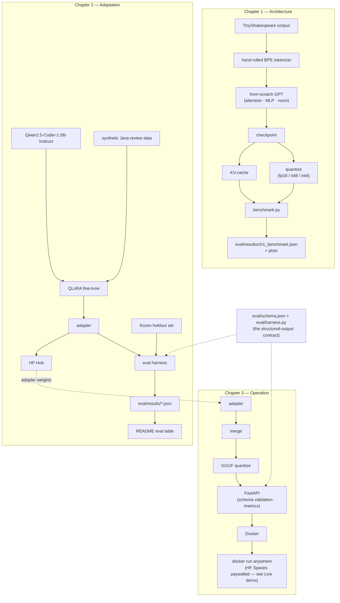
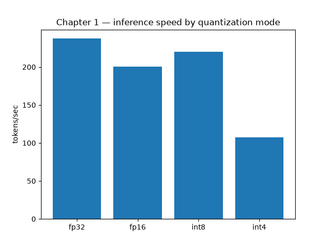
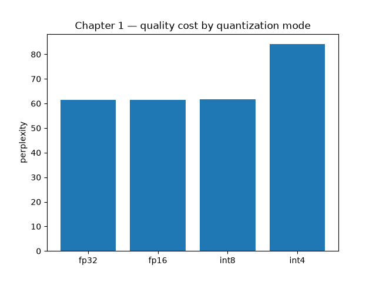
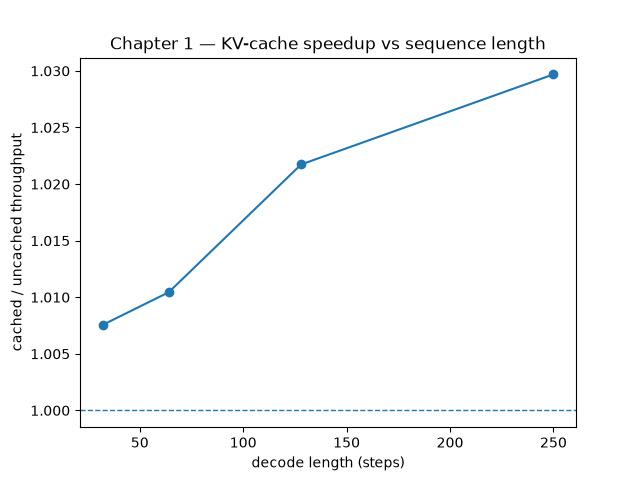

# LLM Engineering: From Architecture to Edge

Three connected chapters on one theme: *understanding a model from its internals all the way to a deployed edge service.*

The chapters share a narrative, not a model. Chapter 1 proves understanding on a toy transformer built by hand. Chapters 2 and 3 take a real small open model and carry it to the edge.

| Chapter | What it does | Headline artifact |
|---|---|---|
| **1 — Architecture** (`ch1_architecture/`) | A GPT-style LM written from scratch in pure PyTorch — embeddings, multi-head attention, MLP, norm, training loop — then a KV-cache and quantization added on top. | tokens/sec speedup curve · perplexity-vs-quantization tradeoff |
| **2 — Adaptation** (`ch2_adaptation/`) | QLoRA fine-tune of `Qwen/Qwen2.5-Coder-1.5B-Instruct` into a Java/Spring code reviewer that emits structured JSON. | head-to-head eval table: fine-tuned vs base vs frontier-API few-shot |
| **3 — Operation** (`ch3_operation/`) | The fine-tuned model quantized to GGUF, served behind FastAPI with schema validation and latency/drift monitoring, containerized, and runnable anywhere with one `docker run`. | Q4_K_M GGUF with no measured quality loss · serving p50/p99 under free-tier CPU limits |

## Live demo

**Not permanently hosted, and why.** The plan was a free CPU Hugging Face Space. In 2026 HF
moved Docker Spaces behind a paid plan (`402 Payment Required` on create), and the free Docker
hosts that remain (Render, Koyeb) give 512 MB of RAM, while this service needs about 1.15 GiB.
This project has no hosting budget, so there is no always-on URL.

What exists instead:
- **The model is public:** [`rkg209/qwen2.5-coder-1.5b-java-review-gguf`](https://huggingface.co/rkg209/qwen2.5-coder-1.5b-java-review-gguf)
  (Q4_K_M, 986 MB).
- **One command runs the whole service anywhere Docker runs.** The container downloads that
  GGUF at a pinned commit, verifies its sha256 and serves the API. See [Run it locally with Docker](#run-it-locally-with-docker).
- **A temporary public link for live demos:** `cloudflared tunnel --protocol http2 --url http://localhost:8000`
  in front of the running container. It lives only as long as the laptop runs it.
- **Serving numbers measured on the production image**, limited to free-tier-sized resources
  (below).

## Architecture

How the three chapters connect — file-shaped, not import-shaped. Chapter 1 is a
self-contained parallel track with no edge into Chapters 2/3: that separation is a design
decision, not an oversight (`CLAUDE.md`'s "the chapters have no runtime dependency on
each other"). Chapters 2 and 3 share one spine: `eval/schema.json` and `eval/harness.py`
are the structured-output contract the whole project hangs on.



## Results

**Chapter 2 — head-to-head on the frozen holdout set** *(spec C5)*

<!-- EVAL_TABLE_START -->
| System | Schema-validity | Bug-catch | n |
|---|---|---|---|
| Fine-tuned (QLoRA, Qwen2.5-Coder-1.5B) | 0.97 | 0.80 | 40 |
| Base model (zero-shot) | 0.00 | 0.00 | 40 |
| Frontier API (3-shot) | 1.00 | 0.82 | 40 |
<!-- EVAL_TABLE_END -->

The holdout is 40 records (30 hand-written synthetic-clean, 10 mined from real Java/Spring
code, all Apache-2.0, labelled from the maintainers' own fix commits). It was frozen — with
`eval/holdout/manifest.json` and `eval/frozen_hashes.txt` — **before any fine-tuning token was
spent**, and the training data generated afterwards was deduplicated against it by content
hash (`ch2_adaptation/holdout_curator.py`). No training, data-generation, or prompt-tuning
code may read it; a repo hook enforces that unconditionally.

**Read the table honestly: the fine-tune lost to the frontier API on both metrics.** It scored
0.97 schema-validity to the frontier model's 1.00, and caught 32 of 40 bugs to its 33 — one
record behind on each. What the fine-tune *did* win, decisively, is the comparison against its
own starting point: the same 1.5B weights, zero-shot, score **0.00** schema-validity on these 40
records. Fine-tuning took that model from unusable-without-a-parser to 39/40 valid, and its one
failure is not a fence — it is unescaped quotes in a Java snippet inside the JSON string. On
n = 40, a one-record gap is 2.5 points and settles nothing about which model is better; it is
reported here because hiding it would be the only dishonest option.

**What the base model's two zeros actually mean.** They are one measurement and one consequence,
and it is worth being precise about which is which. The 0.00 **schema-validity** has two stacked
causes: all 40 responses arrive wrapped in a markdown fence (the harness does not strip fences to
be kind), and even if you did strip them, only 12 of 40 would pass — 27 fail the `severity` enum,
writing `"error"` or `"warning"`, a linter's vocabulary, where the schema demands
`critical|major|minor|info`, and one is malformed JSON outright. Fine-tuning fixed both layers,
which is a more interesting claim than fixing the wrapper alone. The 0.00 **bug-catch** is then
arithmetic, not evidence: the harness scores `caught = valid and line-within-±2`, so a system at
0.00 validity cannot score above 0.00 catch whatever it found. The base model's raw outputs do
identify real defects — SQL injection, a race in a withdrawal path — and none of them could be
checked against ground truth because none parsed. Read that cell as "no scorable answer", not as
"read the code blindly".
[`docs/finetune-vs-prompting.md`](docs/finetune-vs-prompting.md) has the per-record breakdown of
where the two disagree, and the cost/latency/privacy case that does not depend on winning this
table.

One measurement asymmetry worth naming rather than burying: the base-model row was scored fp32 on
CPU, the fine-tuned row 4-bit NF4 on an A100 (the adapter is reloaded exactly as it was trained),
and the frontier row is an API with native JSON mode. Same holdout, same harness, same prompts —
different execution substrates, by design, because each row is measured the way that system would
actually be run.

**Chapter 1 — speedup and quantization cost** *(spec A5)*

<!-- CH1_BENCHMARK_START -->
| Mode | tokens/sec | perplexity |
|---|---|---|
| fp32 | 237.4 | 61.45 |
| fp16 | 200.2 | 61.45 |
| int8 | 219.8 | 61.70 |
| int4 | 107.6 | 84.11 |

KV-cache: 271.2 tok/s cached vs 270.8 tok/s uncached (1.00x).

| Decode length | cached tok/s | uncached tok/s | speedup |
|---|---|---|---|
| 32 | 273.6 | 271.6 | 1.01x |
| 64 | 274.3 | 271.4 | 1.01x |
| 128 | 273.7 | 267.9 | 1.02x |
| 250 | 272.9 | 265.0 | 1.03x |

Perplexity is measured on a held-out tail of the corpus that the training run never saw, so it is a generalization number rather than a memorization one.




<!-- CH1_BENCHMARK_END -->

A 21.0M-parameter GPT written from scratch, trained for 3000 steps on one A100, scoring
**perplexity 61.45 on a held-out tail of the corpus it never trained on** (16,287 tokens,
10% of the corpus, split off before the BPE tokenizer was fitted). `max_steps` and the
learning rate come from a measured sweep on held-out loss, not from a guess — see
`ch1_architecture/configs/full.yaml`, which records the sweep that set them.

**On the A100, every quantization mode is slower than fp32 — and on CPU, int8 is 1.51×
faster.** The same checkpoint and the same code, benchmarked on both (job 402166 on an
A100, job 402179 on a CPU node):

| Mode | A100 tok/s | CPU tok/s | perplexity |
|---|---|---|---|
| fp32 | 237.4 | 40.2 | 61.45 |
| fp16 | 200.2 | 22.2 | 61.45 |
| int8 | 219.8 | **60.5 (1.51×)** | 61.70 |
| int4 | 107.6 | 22.8 | 84.11 |

That reversal is the whole point. Absmax quantization here is hand-written in pure
PyTorch (the chapter's premise — no bitsandbytes), so it dequantizes inside the forward
pass with no fused kernel: it buys memory and pays arithmetic. On an A100, where memory
was never the binding constraint, that is a straight loss. On a CPU, where the fp32
matmul is bandwidth-bound, the smaller weights win back more than the dequantization
costs — **1.51× throughput for a 0.42% perplexity increase**, which is the trade
quantization is supposed to offer.

int4 loses on both devices (0.45× on the A100, 0.57× on CPU) for a 37% perplexity
increase, because 4-bit values must be unpacked before they can be used at all. Neither
result is a bug, and neither is discarded: this is the measured reason Chapter 3 serves
quantized GGUF on CPU rather than an unquantized model on a GPU it cannot afford.

**The KV-cache reads 1.03× on the A100 and 4.45× on CPU — same weights, same code.**

| Decode length | A100 speedup | CPU speedup | CPU cached tok/s | CPU uncached tok/s |
|---|---|---|---|---|
| 32 | 1.008× | 2.44× | 220.7 | 90.4 |
| 64 | 1.010× | 2.99× | 226.6 | 75.7 |
| 128 | 1.022× | 3.31× | 224.0 | 67.6 |
| 250 | 1.030× | **4.45×** | 219.8 | 49.4 |

Both columns describe one mechanism. Cached throughput is flat as the sequence grows —
~220 tok/s on CPU at every length, ~273 on the A100 — because a cached step does the same
work no matter how much history precedes it. Uncached throughput decays, and on CPU it
collapses (90.4 → 49.4 tok/s) because re-encoding a lengthening prefix costs real time
there. On the A100 it barely moves (271.6 → 265.0): a 21M-parameter model at batch 1
spends ~4.3 ms per step on kernel-launch overhead against ~0.08 ms of attention compute,
so the cache is eliminating work that was already free.

The honest reading is that a KV-cache's value is not a property of the cache. It is a
property of how expensive the prefix re-encoding is on the hardware in hand, and the
gap between 1.03× and 4.45× on identical weights is the cleanest way to show it. The
CPU number is also the one that matters for this project, since Chapter 3 serves on CPU.
See [`docs/kv-cache.md`](docs/kv-cache.md).

The three plots show three independent tradeoffs, not one curve: inference speed by
quantization mode, the perplexity cost that speed buys (see
[`docs/quantization.md`](docs/quantization.md)), and the KV-cache speedup against decode
length.

**Chapter 3 — serving** *(specs O1/O3/O5)*

The quantized model loses nothing measurable against the adapter on the same 40-record
holdout:

| Model | Schema-validity | Bug-catch | Size |
|---|---|---|---|
| Fine-tuned adapter (HF, 4-bit) | 0.975 | 0.80 | — |
| **Q4_K_M GGUF (llama.cpp, CPU)** | **1.00** | **0.80** | **986 MB** |

At n = 40 the one-record difference is noise, so read it as "no measured loss", not a gain.

<!-- SERVING_METRICS_START -->
| Metric | Value |
|---|---|
| p50 latency | **2.16 s** |
| p99 latency | **3.68 s** |
| Throughput (sequential, one user) | **0.44 req/s** |
| Errors | 0 / 30 |
| Cold start (image start → pinned download + sha256 check → ready) | 138 s |
| Memory in use | 1.25 GiB |

Measured 2026-09-22 03:20 UTC by `scripts/benchmark_serving.py` (30 requests after one warm-up),
against the **production image** run with `docker run --cpus=2 --memory=4g`, the size of a
free CPU tier. That is a laptop (Apple M4, native arm64 build), not a hosted deployment; there
is no hosted deployment (see [Live demo](#live-demo)). The table is the median of three
back-to-back runs. Throughput ranged **0.32–0.51 req/s** across them, because the laptop had
background load. Raw numbers: `eval/results/serving_metrics.json`.

**Throughput still misses NFR-3's 1 req/s target, by about 2×, and it is reported as a miss.**
Each review generates ~78 tokens of JSON. On 2 cores this model decodes ~30 tokens/s, so a
request takes 2–3 s. 1 req/s would need ~80 tokens/s, which is more than this laptop's M4
reaches for this model with *no* CPU limit (~56 tokens/s). What was tried:

| Change | Effect under `--cpus=2` | Kept? |
|---|---|---|
| `n_threads` 4 → 2 (match the CPU quota) | ~+40% throughput in an interleaved A/B (median 2.7–3.4 s vs 4.0–4.4 s per request). 4 threads on 2 CPUs spin-wait and get throttled. | **Yes.** It was a config bug. The 2026-09-18 figure was 0.32 req/s with 4 threads. |
| Q4_0 instead of Q4_K_M (faster repacked CPU kernels) | ~16% faster (2.08 s vs 2.47 s), but holdout scores dropped to validity 0.975 / bug-catch **0.75** (vs 1.00 / 0.80) | **No.** Slower but more accurate wins. |
| Prompt-lookup speculative decoding | ~10× *slower* (26 s per request) | No |

Reaching 1 req/s would take a smaller model (e.g. the 0.5B Coder, which needs a new fine-tune and
will probably catch fewer bugs), shorter reviews (a retrain), or more cores (money). Serving
concurrent requests would raise aggregate throughput, but NFR-3 is defined for a single user.
<!-- SERVING_METRICS_END -->

## What this cost

The constraint is part of the result: everything above was built under a **≈$1 cap on total
LLM API spend**, and the actual spend so far is **$0.00** — the synthetic training data (226
records) and the frontier baseline both fit inside `gemini-3.5-flash-lite`'s free tier, capped
and logged either way (see `Usage` in `ch2_adaptation/baseline.py` and
`ch2_adaptation/data/provenance.json`). Training runs use **GPU time that costs the project
nothing**: the QLoRA fine-tune took 28 seconds on one A100 on a university HPC cluster
(PARAM Rudra, IIT Bombay), and the recipe is sized to fit a free Colab/Kaggle session. Serving
is a **CPU-only, free HF Spaces tier** with no GPU at inference time. A reader who doesn't know the budget can't
see what was actually achieved inside it.

## How to read these numbers

**Chapter 2 is distillation, not independent discovery.** A frontier model generated the
synthetic training labels; the fine-tuned model is a small specialist trained on that
signal. The comparison in the table above is honest about what it's measuring: whether a
1.5B model, taught by a frontier model's outputs, can match or beat that same frontier
model's live few-shot performance on the narrow task it was taught — not whether a small
model independently rediscovered code review.

The eval set is independent of the training data and only partly real — 30 records
synthetic-clean, 10 mined from real Java/Spring code, all 40 frozen first and deduplicated
by content hash against everything used in training or prompting. Where the fine-tuned model
loses, the table above says so next to where it wins — it lost both published metrics to the
frontier API by one record each, and that is stated above rather than left to the cells. The cost/latency/
privacy argument (a 1.5B model on a CPU box, no per-request API cost, no code leaving the
network) holds regardless of which system wins on raw accuracy.

Chapter 1's model is a **toy**, trained on a small corpus, built to demonstrate the
mechanics of attention, training, caching, and quantization from first principles. Its
perplexity is not comparable to any production model's and isn't meant to be.

## Getting started

```bash
uv sync --extra dev                              # build the environment
uv run ruff check . && uv run black --check . && uv run pytest -q
uv run python -m ch1_architecture.train --config ch1_architecture/configs/smoke.yaml
```

Everything has a `smoke` profile that runs on CPU in seconds. Full training runs are launched **manually on a GPU box** (Colab / Kaggle / cluster) and never from a development session — see `CLAUDE.md`.

## API

`ch3_operation` serves the reviewer over HTTP (spec O2). Locally:

```bash
uv run python -m ch3_operation.serve --config ch3_operation/configs/smoke.yaml
curl -s -X POST localhost:8000/v1/review -H 'content-type: application/json' \
  -d '{"code": "public String f(User u){return u.getProfile().getName();}"}'
```

A real exchange with the Q4_K_M GGUF, served with the production config (`temperature 0.2`,
CPU), copied verbatim from the response and not edited:

```java
public int sum(int[] a) {
    int s = 0;
    for (int i = 0; i <= a.length; i++) s += a[i];
    return s;
}
```

```json
{"severity":"critical","category":"Logic Error","line":3,"issue":"The loop condition checks i <= a.length, which will cause an ArrayIndexOutOfBoundsException when i equals a.length because the array index is zero-based.","suggested_fix":"Change the loop condition to i < a.length to avoid accessing out-of-bounds elements."}
```

| Method | Path | Notes |
|---|---|---|
| `POST` | `/v1/review` | Returns a validated `ReviewOutput` (`severity`, `category`, `line`, `issue`, `suggested_fix`) on `200`. `POST /review` is a deprecated alias for the same route. |
| `GET` | `/health` | `200` once the model is loaded, `503` while it's still starting. |
| `GET` | `/metrics` | Prometheus text format *(spec O3)*. |

A model failure to produce schema-valid JSON is an honest `422`, never silently reshaped into something that looks like success (one inference, two parse attempts, no retry). Every response — success or error — carries an `X-Request-Id` header; error bodies use one envelope:

```json
{"error": {"code": "VALIDATION_FAILED", "message": "...", "detail": null}, "request_id": "..."}
```

| Status | `error.code` | Trigger |
|---|---|---|
| `400` | `INVALID_REQUEST` / `CODE_FIELD_EMPTY` | Malformed body, or `code` missing/blank |
| `413` | `PAYLOAD_TOO_LARGE` | Body over `max_request_bytes` (32 KB) |
| `422` | `VALIDATION_FAILED` / `SCHEMA_VIOLATION` | Model output didn't parse, or parsed but failed the schema |
| `500` | `INFERENCE_ERROR` | The backend raised mid-generation |
| `503` | `MODEL_NOT_READY` | Request arrived before the model finished loading |

This is `planning/05-api-design.md`'s registry with two intentional differences, noted there as drift rather than silently diverging: routes are versioned at `/v1/review` (the design doc predates that decision and describes an unprefixed `/review`), and `429 RATE_LIMITED` is defined in the registry but not enforced in v1.0 — HF Spaces throttles at the infrastructure level.

## Run it locally with Docker

The image is CPU-only (no CUDA anywhere) and fetches its `.gguf` at container start rather than baking it into a layer, so the same image works against any HF Hub model repo:

```bash
docker build -f docker/Dockerfile -t reviewer:local .
docker run --cpus=2 --memory=4g -p 8000:8000 reviewer:local
```

No model flags are needed. The image's serving config pins the GGUF to an exact Hub commit
(`a2133f6…`) and sha256, so every container serves the bytes the published numbers were
measured on. To serve a different model, pass `-e MODEL_REPO=… -e MODEL_FILE=…
-e MODEL_REVISION=<40-hex commit SHA>` (optionally `-e MODEL_SHA256=…`). A branch name is
refused. The pinned revisions are listed in [REPRODUCING.md](REPRODUCING.md#pinned-artifacts).

That is exactly how the serving numbers above were measured. Add `--platform linux/amd64` to
the build when the image is for an x86 host; a native build is faster to run on Apple Silicon.
To share it temporarily, run `cloudflared tunnel --protocol http2 --url http://localhost:8000` in a second
terminal; it prints a public `https://….trycloudflare.com` URL.

First boot is slow — the model download happens before `/health` reports ready. To run against the committed CI fixture instead of a real model (no network needed beyond the build):

```bash
docker run -p 8000:8000 \
  -v "$(pwd)/ch3_operation/tests/fixtures/tiny.gguf:/models/model.gguf:ro" \
  -e MODEL_PATH=/models/model.gguf \
  -e CONFIG_PATH=/app/ch3_operation/configs/smoke.yaml \
  reviewer:local
```

`DOCKER=1 uv run pytest ch3_operation/tests/test_docker.py -q` builds the image, runs it, and hits `/health`, `/metrics`, and `POST /v1/review` for real — skipped by default since it needs a Docker daemon and takes minutes.

## How this repo is built

Spec-driven development. The backlog lives in [`specs/STATUS.md`](specs/STATUS.md); each item has a spec file that flows `/specify → /clarify → /plan → /tasks → /implement`. The design documents it was derived from are in [`planning/`](planning/) and [`llm-engineering-architecture-to-edge.md`](llm-engineering-architecture-to-edge.md).

Three interview-defense notes, written against this repo's own code and measurements —
what naive attention costs and what a KV-cache actually fixes, why a small fine-tune can
beat few-shot prompting on structured output, and what quantization trades away — live in
[`docs/`](docs/README.md), alongside the deploy runbook.

## Reproducing

```bash
make setup && make smoke
```

No GPU, no API key, no W&B account required — every smoke config disables W&B and stubs
the frontier API. See [`REPRODUCING.md`](REPRODUCING.md) for the full five-minute path,
the GPU-afternoon full-run instructions, the determinism guarantee and its limits, and a
table tracing every published number back to the config and command that produced it.
